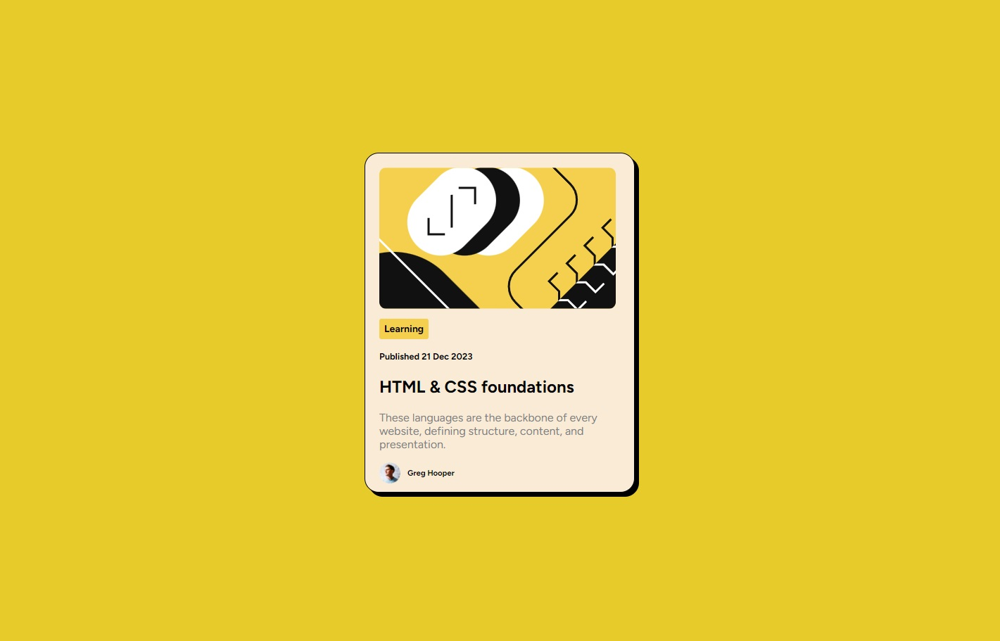

# Frontend Mentor - Blog preview card solution

This is a solution to the [Blog preview card challenge on Frontend Mentor](https://www.frontendmentor.io/challenges/blog-preview-card-ckPaj01IcS). Frontend Mentor challenges help you improve your coding skills by building realistic projects.

## Table of contents

- [Overview](#overview)
  - [The challenge](#the-challenge)
  - [Screenshot](#screenshot)
  - [Links](#links)
- [My process](#my-process)
  - [Built with](#built-with)
  - [What I learned](#what-i-learned)
  - [Continued development](#continued-development)
  - [Useful resources](#useful-resources)
- [Author](#author)

## Overview

### The challenge

Users should be able to:

- See hover and focus states for all interactive elements on the page.
- Design is responsive for different screen sizes.

### Screenshot

Blog preview card

Blog preview card (focused)

_Note - Windows screenshot has removed the cursor pointer hovering over the title in screenshot 2 showing the card's focused state._

### Links

- Live Site URL: [Github Pages site](https://i-prkr.github.io/blog-preview-card/)

## My process

I really wanted to try creating the component and design using the css grid layout system. Due to this I spent some time refreshing on the css grid display, and then creating the grid on the canvas so that while creating the component I could see it mapped to the grid. Once I had the grid, then created the component and tried to use the grid to help with sizing as well as to help with responsive design for different screen sizes. I spent more time than expected just playing around with the grid, trying to work out the best way to handle responsive design and get it working properly.

In short the process was:

1. Create the css grid display and the card against it.
2. Create the elements within the card and layout.
3. Style the elements correctly and position them.
4. Add responsive design working with the grid-template to change size appropraitely for different screen sizes.
5. Add the focus effects for when hovering over the card.

### Built with

- Semantic HTML5 markup
- CSS custom properties
- CSS Grid

### What I learned

I was able to refresh on how the css grid works, and spent a lot of time playing around with it trying to get the component to size correctly, particularly with different screen sizes. The @media queries in css is not someting I had worked with much, and so I learned alot playing around with them in combination with the css grid.

I also learned the nesting features in pure css, and tried to make use of that in keeping maintable and easy to read css code. Another thing I learned particularly in reponse to other feedback was understanding px and rem for font sizing, and the best practices for working with them with responsiveness and accessibility in mind.

### Continued development

I really need to continue working with media queries and making things responsive in an effective way. I'm not sure that my eventual solution after the time spent is the best solution for responsiveness with css grid.

I also want to start learning and using more css frameworks, and begin experimenting with either Scss or Tailwind.

### Useful resources

- [Grid Design](https://elementor.com/blog/grid-design/) - This really helped me to understand the css gid layout in practice, and different ways to utilise the css grid pattern to create different styled pages.
- [Component/Page layouts](https://ishadeed.com/article/thinking-like-a-front-end-developer/) - This was helpful in how to analyse different layout patterns, and being able to start to piece together from a high level different layouts.
- [Grid Design for responsiveness](https://dev.to/jonstodle/responsive-layout-with-css-grid-part-1-grid-areas-5632) - This was a simple example that helped me in trying to determine the best way to go about responsiveness using css-grid.

## Author

- Website - [I Parker](https://github.com/i-prkr)
- Frontend Mentor - [@i-prkr](https://www.frontendmentor.io/profile/i-prkr)
